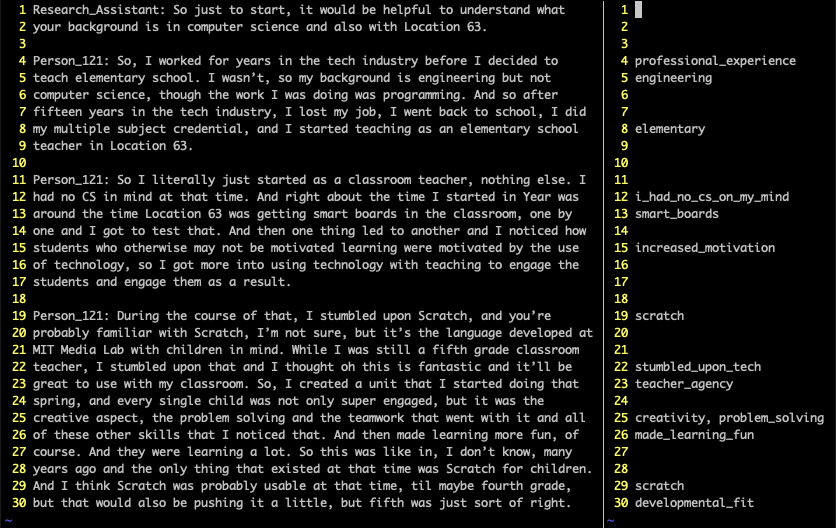

Introduction
============

This documentation introduces ``qc``, a free, open-source software package for
qualitative data analysis (QDA) designed to support the application of
computational thinking (CT) to qualitative research. 

QDA, in its various
forms, is a core methodology for qualitative, mixed methods, and some
quantitative research in the social sciences. There are a variety of
well-known commercial QDA software packages such as NVivo, Dedoose,
Atlas.TI, and MaxQDA. I have used several of these individually and in
research groups; ``qc`` emerged from my loosely-theorized
dissatisfaction with these tools. I value open and extensible research
software; these were proprietary and expensive. I value “plain-text
social science” (Healy 2020); these graphical user interfaces (GUIs)
were user-friendly but ultimately limiting. As I developed prototypes of
``qc`` for my own use in several prior research projects (Proctor,
Bigman, and Blikstein 2019), I found that I was continually augmenting
(Engelbart 1962) my ability to engage with complexity rather than
simplifying the problem space. The release of ``qc`` documented here
results from a redesign and reimplementation of the original tool, in
the hope that it will be useful to others.

Background
==========

Qualitative data analysis
-------------------------

``qc`` is designed to support the application of computational thinking
(CT) to the process of qualitative data analysis (QDA). In the social
sciences, QDA is a process of applying codes to text, images, video, and
other artifacts, then analyzing the resulting patterns of codes and
using the codes to more deeply understand the text. The adjective
“qualitative” applies to the data being analyzed (that is, the data
represents or describes something that happened) and potentially also to
the research design.

When QDA is used in quantitative or mixed-methods research, it is
typically used as a means of transforming loosely-structured data such
as an interview transcript into categories or codes which can then be
used in downstream quantitative analysis. Within this paradigm, the data
resulting from QDA are typically treated as observable variables
standing in for latent representing latent constructs of interest. The
researcher will prioritize reliability in QDA. Reliability means that if
another researcher were to repeat the QDA process, they should expect
similar results. If the QDA is not reliable, then there is no
justification for claiming that the results of downstream analysis
applies to the situation represented by the qualitative data. (Concern
for validity often goes hand in hand with concern for reliability, but I
do not address validity here because it is more related to how QDA
supports a research argument than the process of QDA, and therefore less
germane for the design rationale for a QDA tool.) Strategies for
improving reliability vary according to methodology, but generally
include the use of standardized codebooks, processes for training
coders, and using measures of inter-rater agreement to confirm that
different coders tend to arrrive at similar results.

In contrast, the goal of qualitative research is to interpret, explain,
or “make the world visible” (Denzin and Lincoln 2011), often with
central interest in how the researcher’s subjectivity (their sense of
who they are) or positionality (their relationship to what is being
studied) shapes the results. Reliability is often irrelevant to a
qualitative research design; the reality under study is understood to be
produced through the research, so the researcher’s subjectivity and
positionality are essential traces of that process. Nevertheless, making
the QDA process transparent by documenting and sharing the researcher’s
iterative process of coding texts and developing interpretations would
make qualitative research more persuasive, and could help other
researchers understand the specific process which led to the results.

Commercial QDA software packages such as NVivo, Dedoose, Atlas.TI, and
MaxQDA, are widespread and well-known; they are commonly taught in
qualitative methods courses, and are a core part of many research
groups’ methodologies. That said, my own observations suggest that there
is quite a bit of heterogeneity in whether and how such tools are used
in practice; collaborators’ preferences or budget pressure sometimes
leads to a “lowest common denominator” of coding texts manually, or
using ad-hoc tools such as word processors or spreadsheets. These can
get the job done, but they have significant limitations with respect to
interpretability and documentation of process. As the corpus or the
research team grows, ad hoc tools become increasingly unwieldy.

Within the qualitative research community, there is a long-running
thread of skepticism toward QDA software (Jackson, Paulus, and Woolf
2018), focused on four main concerns: that digital tools create distance
between the researcher and the data; that if particular digital tools
become dominant they may homogenize and standardize qualitative
research; that digital tools mechanize and dehumanize qualitative
research; and that digital tools decontextualize qualitative data by
privileging quantification. The design rationale of ``qc`` takes these
concerns seriously, but argues that for users who are able to
conceptualize the QDA process in computational terms, a tighter
partnership with the computer may yield more intimate, situated,
humanized insights grounded in the researcher’s subjectivity.

Computational thinking
----------------------

The central design hypothesis of ``qc`` is that a closer partnership
between the researcher and the computational tool can enhance the
quality of QDA. The kind of close partnership I have in mind depends on
the researcher’s ability to conceptualize the data and the process in
computational terms, becoming immersed in the matrices, trees, and other
computational structures inherent to QDA rather than remaining “outside”
at the level of user interface. This practice, called *computational
thinking*, has been defined as “the thought processes involved in
formulating problems and their solutions so that the solutions are
represented in a form that can effectively be carried out by an
information-processing agent” (Wing 2011, 33). The application of CT to
QDA would mean conceptualizing the goal and the process of QDA in
computational terms, keeping a mental model of the work the computer is
doing for you.

All QDA software will be a “leaky abstraction” (Spolsky 2002), a
simplification which aims to let the user get their work done without
needing to worry about the complexity of how the work is
accomplished–and which only partially succeeds at this goal. Therefore,
actively thinking about how one’s tools are modeling the problem is
necessary, or at least has the potential to improve the tool’s
effectiveness. As an analogy, statistical software can be a powerful
tool which improves the efficiency and quality of research, but only
when the user has a clear conceptualization of what they are trying to
achieve and what the software is going to do for them. This requires a
certain amount of expertise on the part of the user as well as a greater
commitment to learning the tool, but asking such a commitment from the
user is justifiable. There are many fields in which experts invest in
learning specialized domains of computing. Examples include
computer-aided design in architecture, expert use of Excel in finance,
and even word-processing for users who choose to invest in learning vim
or emacs. In all of these cases, the user has to get involved at least
to some extent in the work the tool is doing for them.

In my own experience with QDA, several computational structures are
often salient; thinking about them has been helpful in improving both
the efficiency and the quality of my QDA practice. The codebook’s nested
tree of codes is the structure within which themes emerge from codes.
Open coding produces a flat list of codes; an iterative process of
grouping related codes together under parent codes gradually produces a
hierarchy of increasingly-grauluar meanings, often with several
top-level themes. ``qc``\ ’s affordances for showing code statistics and
finding coded excerpts of codes and their children helps guide this
process. I often conceptualize the process of querying for statistics
and coded examples in terms of a relational database, scoping queries by
code, coder, and document. Finally, I draw on concepts and practices
from version control systems such as git in managing research progress.
Tracking changes to the project makes it easier to document the process,
step back to previous versions, and to maintain multiple versions in
parallel.

Design rationale
================

This section explains how several design decisions support ``qc``\ ’s
goal of engaging CT in the QDA process.

Command-line interface (CLI)
----------------------------

The most surprising decision in the design of ``qc`` may be its
implementation as a command-line utility rather than a graphical user
interface such as a web application. Users who are not already persuaded
of the value of a text-based user interface (CLI) are unlikely to choose
this tool. While a graphical user interface (GUI) provides stronger
affordances (disclosing the actions available to the user), a CLI
requires the user to make a cognitive reach for what they are looking
for. In my own experience, however, a CLI invites a more active stance
than a GUI, requiring the user to reach “into” the sensemaking process,
maintaining an internal model of the emerging qualitative analysis.

A CLI is particularly strong where the underlying model is too complex
to present in its entirety in a single view. QDA is an example of such a
situation. Even in a moderately-sized corpus, there is too much text to
be able to engage it directly and there are too many codes to hold in
mind at once (never mind their emergent tree structure). If a GUI were
to support such complex queries, it would likely be tucked away in a
menu and would require a complex form–losing the GUI’s advantages in
discoverability.

Rich query interface
--------------------

Many of ``qc``\ ’s commands can be thought of as views onto the model;
in my QDA process I am constantly moving between coding, viewing
examples of previosuly-applied codes, revising the structure of the
codebook, running analyses, and writing memos. From time to time I am
also interested in comparing my coding with that of other team members.
``qc``\ ’s queries offer a powerful array of options. Consider the
following query, whose complexity is not atypical in normal usage:

::

   $ qc codes stats equity participation --recursive-codes --recursive-counts \
   --pattern round1 --min 5 --depth 2 --unit paragraph --format latex

This query reports counts for the codes “equity,” “participation,” and
all their subcodes, showing usage for the code itself as well as a sum
of counts for all subcodes, restricting the count to documents whose
names match “round1” and using the paragraph as a unit of analysis. The
query only reports codes which were used at least five times, and only
goes two levels deep in the hierarchy. Finally, the output is formatted
as latex.

The specifics of these options are covered in the following sections;
what is important from a design perspective is how a query can be built
up from multiple options similar to query-builder libraries in
high-level programming languages which offer idiomatic interfaces for
constructing SQL queries. This design is also informed by the UNIX
philosophy (McIlroy, PInson, and Tague 1978), that programs should do
one thing but do it well.

Storing data in text files
--------------------------

All files related to a ``qc`` project are contained within a directory:

::

   project
   ├── codebook.yaml
   ├── corpus
   │   ├── admin.txt
   │   ├── board_member.txt
   │   └── teacher.txt
   ├── qualitative_coding.sqlite3
   └── settings.yaml

At first glance, it may be surprising that project data is stored in
three different locations and formats (plain text files within the
corpus directory, the codebook in a ``yaml`` file, and other data in a
``sqlite3`` relational database), but there are practical benefits.
Corpus files are plain text, so they can be integrated into pipelines as
part of a broader research workflow. ``yaml`` is a structured data
format designed for human reading and writing, well-suited for editing
the tree of codes. Other project data, including relationships between
codes and document lines, is stored in a standard relational database in
a straightforward schema which could be integrated into other
applications. (The initial version of ``qc`` stored all data in text
files; the database was added to improve performance.) In almost all of
our existing ``qc`` projects, QDA is part of an analytical pipeline. The
prior and subsequent processes operate on

Vignette
========

In the style of vignettes published with R packages (Wickham and Bryan
2023), this section provides a narrative introduction to ``qc``, guiding
a first-time user through installation and initial usage while also
pointing out features and suggesting workflows. The QDA workflow best
supported by ``qc`` is similar to that of other QDAS products: an
iterative cycle of “notice things,” “think about things,” and “collect
things” (Seidel 1998, 2). The primary difference between ``qc`` and
today’s well-known QDAS products is in the relationship between the user
and the software: ``qc`` provides different affordances for noticing,
thinking about, and collecting ideas during QDA.

Installation
------------

``qc`` is distributed via the Python Package Index (PYPI), and can be
installed on any POSIX system (Linux, Unix, Mac OS, or Windows Subsystem
for Linux) which has Python 3.9 or higher installed. If you want to
install ``qc`` globally on your system, the cleanest approaach is to use
`pipx <https://pipx.pypa.io/stable/>`__.

::

   pipx install qualitative-coding

If your research project is already contained within a Python package
and you want to install ``qc`` as a local dependency, simply add
``qualitative-coding`` to ``pyproject.toml`` or ``requirements.txt``.

``qc`` relies on `Pandoc <https://pandoc.org/>`__ for converting between
file formats, so make sure that is installed as well. ``qc`` uses a text
editor for coding; you should install Visual Studio Code, the default
editor, unless you prefer a different editor such as emacs or vim.

Exploring an existing project
-----------------------------

The fastest way to experience what ``qc`` has to offer is to start with
an exisitng project: an excerpt from the coded interview transcripts
from members of a committee considering whether to add computer science
to the district’s primary and secondard schools (Proctor, Bigman, and
Blikstein 2019). The commands below create a directory on the Desktop,
download the demo project, and unpack it into the directory.

::

   $ cd ~/Desktop
   $ curl -O https://github.com/cproctor/qualitative-coding/blob/main/demo.qdpx
   $ mkdir qc_demo
   $ cd qc_demo
   $ qc init --import ../demo.qdpx

Now let’s use ``qc`` to look around this project. Which documents are
included in the corpus?

::

   $ qc corpus list
   admin.txt
   board_member.txt
   teacher.txt

What codes have been applied? ``qc codes stats`` will show all codes in
the codebook with a count of the number of uses across the whole corpus.
However this project was coded using open coding, resulting in 112
distinct codes–too many to easily comprehend. Instead, we will modify
the command to show the nested tree of codes, along with a count for
that specific code as well as a total for that code and all of its
children. Finally, ``--min 10`` filters out codes used fewer than ten
times.

::

   $ qc codes stats --recursive-codes --recursive-counts --min 10
   Code                              Count    Total
   ------------------------------  -------  -------
   rq1_definition                        5       55
   .  rationales                         0       27
   .    equity                          12       15
   rq2_curriculum_and_instruction        0       83
   .  curriculum                         4       40
   .    cs_scope_and_sequence            0       10
   .    graduation_requirement          11       11
   .    interdisciplinary_cs             2       11
   .  pedagogy                           4       41
   .    participation                    3       15
   .    tools                            1       12
   rq3_process                           0       95
   .  identity                           0       54
   .    computational_identity           6       22
   .    identity_categories              1       26
   .      gender                        19       19

We can zoom in on particular codes using the same command. For example,
the following command shows the code tree for ``rationales``, or
justifications given for why computer science ought to be taught in
primary and secondary schools. We again specify recursive codes and
recursive counts, this time using the short form of these flags
(``-ra``). We also add the ``--by-document`` flag, to get a sense of
differences across interviewees.

::

   $ qc codes stats rationales -ra --by-document
                                   admin.txt    board_member.txt    teacher.txt    Total
   -------------------------------  -----------  ------------------  -------------  -------
   rq1_definition:rationales                 12                  10              5       27
   .    equity                                7                   8              0       15
   .      every_student                       2                   0              0        2
   .      everyone_should_learn_cs            1                   0              0        1
   .    exposure                              3                   1              4        8
   .    job                                   2                   1              1        4

It appears that equity (as a rationale for teaching computer science)
came up more in interviews with the administrator and the board member
than with the teacher. To explore this pattern, we can we can view lines
coded with “equity,” or any of its child codes.

::

   $ qc codes find equity -r

   admin.txt (7)
   ================================================================================
   [10:15]
   learning computer science when I went to college back in the                     |
   early '70s and I could see that was something that I thought, just like math,    |
   every kid should know. So, fast forward to when I got to [district], which was   | everyone_should_learn_cs
   in the early '80s, I got there in '83 and I started teaching computer science    |
   in about '85, as well as math and I recognized that it was a niche class and it  |

   [63:68]
   academic officer, the elementary academic officer, just figured we would spin    |
   our wheels and we wouldn't go anywhere but when we started talking about         |
   opportunity, she recognized that was an opportunity for all students and being   | equity
   a member of the underrepresented minority, she got behind us, which was great.   |
   However, this year, she did not come to our meetings because she didn't think    |

   [85:90]
   kids, that they would have English as a second language kids so that we could    |
   make sure that we were going to create a program that would meet the needs of    |
   all the students and create opportunity for all students to learn computer       | equity
   science, not just programming but the team work and the thinking, the            |
   analytical thinking that goes into computer science but definitely programming   |

Here’s an interesting pattern: the discussion of equity tends to be
framed in universal terms–what “every kid should know;” an “opportunity
for all students.” This consideration of what students should learn
feels connected to the “participation” codes under research question 2
(how CS should be taught) and the “committee_participation” codes under
research question 3 (the decision-making process which should be used).
We can use a cross-tabulation to quickly explore this idea. The ``-a``
flag again counts all subcodes. This time we omit ``-r``; including
subcodes as separate items in the cross-tabulation would make the table
unweildy.

::

   % qc codes crosstab -a equity participation committee_participation
                   code    equity    participation    committee_participation
   -----------------------  --------  ---------------  -------------------------
                    equity        15                7                          0
             participation                         15                          0
   committee_participation                                                     9

The “equity” and “participation” codes co-occur quite a bit, but neither
co-occurs with “committee_particpation.” This illustrates one of the
paper’s findings: that many of the well-documented attitudes and
stereotypes that exclude students from computer science learning in the
classroom also appeared in decision-making processes about K12 computer
science, such as the committee under study.

The default unit of analysis is a line, so that the cross-tabulation
above shows how many lines have both codes. The ``--unit`` option could
be used to specify a different unit of analysis (``paragraph`` and
``document`` are supported; a window-based unit of analysis is under
development).

The next steps from here might include additional coding (using
``qc code``), editing the codebook (``codebook.yaml``), further
articulation of the codebook, or writing memos (``qc memo``) to document
emerging themes. We have found that in larger projects, the options to
scope queries to subsets of coders or subsets of the corpus become
increasingly useful. The query outputs shown above can also be formatted
as CSV or JSON for downstream processing, or as LaTeX, HTML, or many
other formats for inclusion in a publication.

Create a new project
--------------------

This section is a guide to setting up a new ``qc`` project. Before
starting, select one or more documents to add to your project’s corpus.
These could be text documents in almost any file format (the default
importer uses `Pandoc <https://pandoc.org/>`__, and so can handle any
file format supported by Pandoc.)

Create a new directory on your filesystem. In this example, we will
create a directory called ``qc_project`` on the current user’s desktop,
and intialize a new project.

::

   $ cd ~/Desktop
   $ mkdir qc_project
   $ cd qc_project
   $ qc init -y

When ``qc init`` is run in a directory which does not have
``settings.yaml``, a settings file is created with default values. When
``qc init`` finds a settings file, it uses those settings to create
project assets in the specified locations. In the code above, we used
the ``--accept-defaults`` (``-y``) flag to combine these two steps. If
you plan to use vim or emacs instead of Visual Studio Code, update the
value of ``editor`` in ``settings.yaml`` accordingly.

Now let’s import a document into the corpus. When you import a document,
``qc`` creates a plain-text formatted copy within ``corpus`` and adds
document metadata to the database. Select a text document (let’s assume
it’s ``~/Desktop/interview_transcript.docx``) and run the following
command. If you want to keep a text document’s existing formatting, use
``--importer verbatim`` to tell ``qc`` not to apply any formatting.

::

   $ qc import ~/Desktop/interview_transcript.docx

We can confirm that the document was imported by listing corpus
documents.

::

   $ qc corpus list
   interview_transcript.txt

Now we will code the document using ``qc code user``, where ``user`` is
the username you want to use while coding. The coding interface is
intentionally simple: the document to be coded and an empty document for
codes are presented side-by-side in your editor of choice, as shown in
Figure 1. Codes are added in the blank document, corresponding to lines
in the corpus document. Each code may be any combination of letters,
numbers, and underscores; when multiple codes are applied to a line,
separate them with a comma. Save and close the codes document to end the
coding session.

   Figure 1. Screen shot of the coding interface

After each coding session, all new codes added to the corpus are
automatically added to the codebook. Depending on the qualitative
methodology being used, you might want to iterate between coding and
organizing the codebook. Commands are provided for renaming codes as the
coding scheme stabilizes (see ``qc codes rename`` below). After open
coding, we often have multiple codes with similar meanings. Sometimes we
choose to rename codes to reduce the total number of distinct codes, but
more often we just group similar codes together as subcodes, and then
use the parent code in our analysis. For example, the codebook excerpt
below shows several layers of nested codes.

::

   - committee_participation:
     - committee_inclusion
     - community_engagement
     - educating_stakeholders:
       - board_education
       - community_education
       - educate_committee
       - educating_community
     - lack_of_cs_understanding
     - self_censorship
     - stakeholders

Much of ``qc``\ ’s power comes from the ability to quickly and easily
iterate the structure of the codebook, and then to see the results
through flexible and powerful queries which use the codebook. Sometimes
it even makes sense to maintain multiple codebooks (See “Specify the
settings file” below for details.) Alternatively, if the project is
stored in a version control system such as git (highly recommended),
changes to the codebook can be maintained in separate branches of the
repository.

From here, you are ready to import more documents, continue coding, and
continue the iterative cycle of “notice things,” “think about things,”
and “collect things” which characterizes QDA. Please feel free to
contact the authors for support, or to share your experience with
``qc``.

Package documentation
=====================

All ``qc`` commands are described below with their most common options,
as of version ``1.3.2``. Use ``--help`` for a full and up-to-date list
of available options for each command.

General commands
----------------

init
~~~~

Initializes a new coding project. If ``settings.yaml`` is not present,
writes the settings file with default values. Make any desired edits,
and then run ``qc init`` again. You can skip this step by passing
``--accept-defaults`` (``-y``) to the first invocation of ``qc init``.
It is safe to re-run ``qc init``.

::

   $ qc init

check
~~~~~

Checks that all required files and directories are in place.

::

   $ qc check

code
~~~~

Opens a split-screen window in your editor of choice, with a corpus file
and the corresponding code file. The name of the coder is a required
positional argument. After optionally filtering using common options
(below), select a document with no existing codes (for this coder) using
``--first`` (``-1``) or ``--random`` (``-r``). Otherwise, you will be
presented with a list of corpus files and asked to choose which to code.

::

   $ qc code chris -1

Save and close your editor when you finish. In the unlikely event that
your editor crashes or your battery dies before you finish coding, your
saved changes are persisted in ``codes.txt``. Run ``qc code --recover``
to resume the coding session.

codebook (cb)
~~~~~~~~~~~~~

Ensures that all codes in the project are included in the codebook. (New
codes are added automatically, but if you accidentally delete some while
editing the codebook, ``qc codebook`` will ensure they are all present.)

::

   $ qc codebook

coders
~~~~~~

List all coders in the current project.

::

   $ qc coders

memo
~~~~

Opens your editor to write a memo, optionally passing ``--message``
(``-m``) as the title of the memo. Use ``--list`` (``-l``) to list all
memos.

::

   $ qc memo -m "It's all starting to make sense..."

upgrade
~~~~~~~

Upgrade a ``qc`` project from a prior version of ``qc``.

version
~~~~~~~

Show the current version of ``qc``. This project uses `semantic
versioning <https://semver.org/>`__.

Corpus commands
---------------

The following commands are grouped under ``qc corpus``.

corpus list (ls)
~~~~~~~~~~~~~~~~

List all files in the corpus.

::

   $ qc corpus list

corpus import
~~~~~~~~~~~~~

Import files into the corpus, copying source files into ``corpus``,
formatting them (see options), and registering them in the database.
Individual files can be imported, or directories can be recursively
imported using ``--recursive`` (``-r``).

::

   $ qc corpus import transcripts --recursive

If you want to import files into a specific subdirectory within the
``corpus``, use ``--corpus-root`` (``-c``). For example, if you wanted
to import an additional transcript after importing the transcripts
directory, you could run:

::

   $ qc corpus import follow_up.txt --corpus-root transcripts

Several importers are available to format files, and can be specified
using ``--importer`` (``-i``). The default importer, ``pandoc``, uses
`Pandoc <https://pandoc.org/>`__ to convert files into plain-text, and
then hard-wrap them at 80 characters. ``verbatim`` imports text files
without making any changes. Future importers will include text
extraction from PDFs and automatic transcription of audio files.

corpus move (mv)
~~~~~~~~~~~~~~~~

Move a document from one corpus path to another, or recursively move a
directory with ``--recursive`` (``-r``). Do not move corpus files
directly or they will become out of sync with their metadata in the
database.

corpus remove (rm)
~~~~~~~~~~~~~~~~~~

Remove a document from the corpus, along with codes applied to the
document. Or recursively remove all documents in a directory with
``--recursive`` (``-r``).

Codes commands
--------------

The following commands are grouped under ``qc code``.

codes list (ls)
~~~~~~~~~~~~~~~

Lists all the codes currently in the codebook.

::

   $ qc codes list --expanded

codes rename
~~~~~~~~~~~~

Goes through all the code files and replaces one or more codes with
another. Removes the old codes from the codebook.

::

   $ qc codes rename humorous funy funnny funny

codes find
~~~~~~~~~~

Displays all occurences of the provided code(s).

::

   $ qc codes find math science art

codes stats
~~~~~~~~~~~

Displays frequency of usage for each code. Note that counts include all
usages of children. List code names to show only certain codes. In
addition to the common options below, code results can be filtered with
``--max``, and ``--min``.

::

   $qc codes stats --recursive-codes --depth 2

Use ``--by-coder`` (``-C``) for separate columns for each coder, and
``--by-document`` for separate columns for each document. When
``--by-coder`` and ``--by-document`` are given, displays a pivot table
of code counts by document and coder. (Optionally filter coders using
``--coders`` (``-c``) and filter documents using the options listed
below in “Filter the corpus.”)

codes crosstab (ct)
~~~~~~~~~~~~~~~~~~~

Displays a cross-tabulation of code co-occurrence within the unit of
analysis, as counts or as probabilities (``--probs``, ``-0``).
Optionally use a compact (``--compact``, ``-z``) output format to
display more columns.

::

   $qc codes crosstab planning implementation evaluation --recursive-codes --depth 1 --probs

Common options
--------------

Specify the settings file
~~~~~~~~~~~~~~~~~~~~~~~~~

Every ``qc`` command supports ``--settings`` (``-s``), which allows you
to specify a settings file. This makes it possible to run ``qc``
commands from outside the project directory or from within scripts
without ambiguity. Sometimes it is also helpful to keep multiple
settings files in a project, for example when different coders prefer
different editors, or if you wish to keep multiple versions of the
codebook with different code trees.

The settings file can also be specified via the ``QC_SETTINGS``
environment variable. This makes it easy to check multiple settings
files into version control (e.g. for users with different preferences,
or to try out different codebook structures).

Filter the corpus
~~~~~~~~~~~~~~~~~

Commands which operate on or iterate over the corpus have options to
filter which documents are included.

-  ``--pattern [pattern]`` (``-p``): Only include corpus files and their
   codes which match ``pattern`` as a substring of the document path.
-  ``--filenames [filepath]`` (``-f``): Only include corpus files listed
   in ``filepath`` (one per line).

Filter code selection
~~~~~~~~~~~~~~~~~~~~~

-  ``code`` [codes]: Many commands have an optional positional argument
   in which you may list codes to consider. If none are given, the root
   node in the tree of codes is assumed.
-  ``--coder`` ``coder`` (``-c``): Only include codes entered by
   ``coder`` (if you use different names for different rounds of coding,
   you can also use this to filter by round of coding).
-  ``--recursive-codes`` (``-r``): Include children of selected codes.
-  ``--depth`` ``depth`` (``-d``): Limit the recursive depth of codes to
   select.
-  ``--unit`` ``unit`` (``-n``): Unit of analysis for reporting.
   Currently “line”, “paragraph”, and “document” are supported.
   Paragraphs are delimted by blank lines.
-  ``--recursive-counts`` (``-a``): When counting codes, also count
   instances of codes’ children. In contrast to ``--recursive-codes``,
   which controls which codes will be reported, this option controls how
   the counting is done.

Output and formatting
~~~~~~~~~~~~~~~~~~~~~

-  ``--format`` ``format`` (``-m``): Formatting style for output table.
   Supported values include “html”, “latex”, “github”, and `many
   more <https://pypi.org/project/tabulate/>`__.
-  ``--expanded`` (``-e``): Show names of codes in expanded form (e.g. 
   “coding_process:grounded”)
-  ``--outfile`` ``outfile`` (``-o``): Save tabular results to a csv
   file instead of displaying them to the screen. This is particularly
   useful in scripts.

Interoperability with other QDA software
----------------------------------------

A working group representing the major QDA software vendors published
the REFI-QDA standard (van Blommestein 2019) specifying a standard data
format for moving QDA projects between software platforms. ``qc``
supports the REFI-QDA standard, allowing projects to be imported and
exported.

However, the REFI-QDA standard recognizes that designs of QDA software
will vary, and the standard does not require that compliant products
import or export with complete fidelity. As noted in the REFI-QDA
standard 1.5, data loss is likely when a project is exported from one
QDA software package into another and back (roundtripping), as neither
package is obliged to implement the full specification. ``qc``\ ’s user
interface and data model are quite different from well-known GUI-based
alternatives. Specifically:

-  Whereas most QDA software allows users to code highlighted
   *selections* in text documents (identified by start and end character
   positions), the fundamental unit of analysis in ``qc`` is the line.
   Exported ``qc`` projects represent coded lines as selections ranging
   from the first to the last character in the corresponding line. When
   QDA projects are imported into ``qc``, selections are mapped onto the
   first corresponding line.
-  *Cases,* or groupings of corpus documents, are not explicitly
   supported in ``qc``, although ``qc`` corpus documents can be
   organized into a nested directory tree. Every relevant ``qc`` command
   affords filtering documents by pattern or by explicit file list, so
   documents can effectively (but implicitly) be treated as belonging to
   cases.
-  ``qc`` corpus documents do not have variables.
-  Nested codes are central to the operation of ``qc``, and every node
   in the code tree is considered a code. Sets (groupings of codes which
   are not themselves codes) are not supported.
-  *Notes* as defined in the REFI-QDA standard are implemented as memos
   in ``qc``, and belong to the project, not to corpus documents or to
   selections. The REFI-QDA standard supports coding of notes. This is
   not explicitly supported in ``qc``, but memos could be imported into
   the corpus and then coded if desired.

Contributing
============

.. image:: https://img.shields.io/badge/Contributor%20Covenant-2.1-4baaaa.svg 
   :alt: Contributor Covenant 2.1 badge
   :target: https://www.contributor-covenant.org/

Development of ``qc`` follows the Contributor Covenant. 
Chris Proctor (chrisp@buffalo.edu), the project lead, would be delighted to hear 
about your experience using ``qc``.
Bug reports, feature requests, and discussion of the future directions of 
``qc`` takes place on the project repository's
`issues page <https://github.com/cproctor/qualitative-coding/issues>`__. 
Code contributions to this project should be via pull requests on this repository. 

If you are considering using ``qc`` in a research project or need help, you are
also welcome to contact Chris directly via email. 

Acknowledgements
================

Partial support for development of ``qc`` was provided by UB's Digital Studio Scholarship
Network. Logo design by Blessed Mhungu. 

References
==========

.. container:: references csl-bib-body hanging-indent
   :name: refs

   .. container:: csl-entry
      :name: ref-denzin2011

      Denzin, Norman K, and Yvonna S Lincoln. 2011. *The Sage Handbook
      of Qualitative Research*. sage.

   .. container:: csl-entry
      :name: ref-engelbart1962

      Engelbart, Douglas C. 1962. “Augmenting Human Intellect: A
      Conceptual Framework,” 64–90.

   .. container:: csl-entry
      :name: ref-healy2020

      Healy, Kieran. 2020. “The Plain Person’s Guide to Plain Text
      Social Science.”

   .. container:: csl-entry
      :name: ref-jackson2018

      Jackson, Kristi, Trena Paulus, and Nicholas Woolf. 2018. “The
      Walking Dead Genealogy: Unsubstantiated Criticisms of Qualitative
      Data Analysis Software (QDAS) and the Failure to Put Them to
      Rest.” *The Qualitative Report*, March.
      https://doi.org/10.46743/2160-3715/2018.3096.

   .. container:: csl-entry
      :name: ref-mcilroy1978

      McIlroy, Doug, E PInson, and B Tague. 1978. “UNIX Time-Sharing
      System.” *The Bell System Technical Journal*, 1902–3.

   .. container:: csl-entry
      :name: ref-proctor2019

      Proctor, Chris, Maxwell Bigman, and Paulo Blikstein. 2019.
      “Defining and Designing Computer Science Education in a K12 Public
      School District.” In *Proceedings of the 50th ACM Technical
      Symposium on Computer Science Education*, 314–20. SIGCSE ’19. New
      York, NY, USA: Association for Computing Machinery.
      https://doi.org/10.1145/3287324.3287440.

   .. container:: csl-entry
      :name: ref-seidel1998qualitative

      Seidel, John V. 1998. “Qualitative Data Analysis.”

   .. container:: csl-entry
      :name: ref-spolsky2002

      Spolsky, Joel. 2002. “The Law of Leaky Abstractions.” *Joel on
      Software*.

   .. container:: csl-entry
      :name: ref-vanblommestein2019

      van Blommestein, Fred. 2019. “REFI-QDA: Exchange of Processed Data
      Between Qualitative Data Analysis Software Packages.”

   .. container:: csl-entry
      :name: ref-wickham2023

      Wickham, Hadley, and Jennifer Bryan. 2023. *R Packages*. "
      O’Reilly Media, Inc.".

   .. container:: csl-entry
      :name: ref-wing2011research

      Wing, Jeanette. 2011. “Research Notebook: Computational
      Thinking—What and Why.” *The Link Magazine* 6: 20–23.
