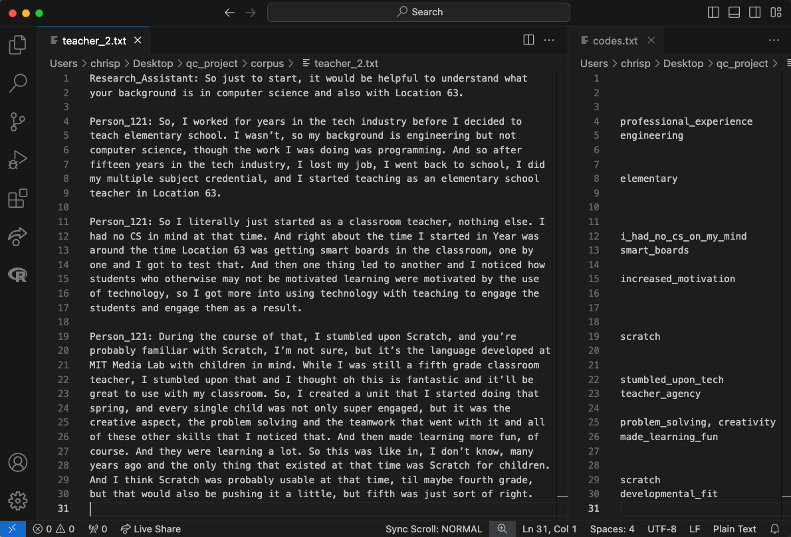
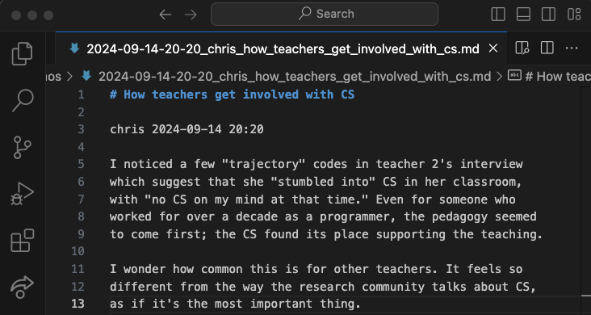
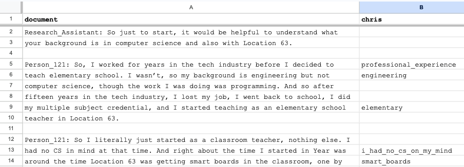

Walkthrough
===========

In the style of vignettes published with R packages (Wickham and Bryan
2023), this section provides a narrative introduction to ``qc``, guiding
a first-time user through installation and initial usage while also
pointing out features and suggesting workflows. The QDA workflow best
supported by ``qc`` is similar to that of other QDAS products: an
iterative cycle of “notice things,” “think about things,” and “collect
things” (Seidel 1998, 2). The primary difference between ``qc`` and
today’s well-known QDAS products is in the relationship between the user
and the software: ``qc`` provides different affordances for noticing,
thinking about, and collecting ideas during QDA.

Installation
------------

Start by following the steps in :ref:`installation`. 

Explore an existing project
---------------------------

The fastest way to experience what ``qc`` has to offer is to start with
an existing project: an excerpt from the coded interview transcripts
from members of a committee considering whether to add computer science
to the district’s primary and secondard schools (Proctor, Bigman, and
Blikstein 2019). The commands below create a directory on the Desktop,
download the demo project, and unpack it into the directory.

.. code-block:: console

   $ cd ~/Desktop
   $ curl -O https://computationalliteracies.net/people/chris/demo.qdpx
   $ mkdir qc_demo
   $ cd qc_demo
   $ qc init --import ../demo.qdpx

Now let’s use ``qc`` to look around this project. Which documents are
included in the corpus?

.. code-block:: console

   % qc corpus list
   admin.txt
   board_member.txt
   teacher.txt

What codes have been applied? ``qc codes stats`` will show all codes in
the codebook with a count of the number of uses across the whole corpus.
However this project was coded using open coding, resulting in 112
distinct codes–too many to easily comprehend. Instead, we will modify
the command to show the nested tree of codes, along with a count for
that specific code as well as a total for that code and all of its
children. Finally, ``--min 10`` filters out codes used fewer than ten
times.

.. code-block:: console

   % qc codes stats --recursive-codes --recursive-counts --min 10
   Code                              Count    Total
   ------------------------------  -------  -------
   rq1_definition                        5       55
   .  rationales                         0       27
   .    equity                          12       15
   rq2_curriculum_and_instruction        0       93
   .  curriculum                         4       47
   .    cs_scope_and_sequence            0       11
   .    graduation_requirement          16       16
   .    interdisciplinary_cs             2       11
   .  pedagogy                           4       43
   .    participation                    3       15
   .    tools                            1       14
   rq3_process                           0      102
   .  identity                           0       60
   .    computational_identity           6       27
   .    identity_categories              1       27
   .      gender                        20       20

We can zoom in on particular codes using the same command. For example,
the following command shows the code tree for ``rationales``, or
justifications given for why computer science ought to be taught in
primary and secondary schools. We again specify recursive codes and
recursive counts, this time using the short form of these flags
(``-ra``). We also add the ``--by-document`` flag, to get a sense of
differences across interviewees.

.. code-block:: console

   % qc codes stats rationales -ra --by-document
                                   admin.txt    board_member.txt    teacher.txt    Total
   -------------------------------  -----------  ------------------  -------------  -------
   rq1_definition:rationales                 12                  10              5       27
   .    equity                                7                   8              0       15
   .      every_student                       2                   0              0        2
   .      everyone_should_learn_cs            1                   0              0        1
   .    exposure                              3                   1              4        8
   .    job                                   2                   1              1        4

It appears that equity (as a rationale for teaching computer science)
came up more in interviews with the administrator and the board member
than with the teacher. To explore this pattern, we can we can view lines
coded with “equity,” or any of its child codes.

.. code-block:: console

   % qc codes find equity -r
   
   admin.txt (7)
   ================================================================================
   [40:45]
   learning computer science when I went to college at Organization_339 back in the |
   early '70s and I could see that was something that I thought, just like math,    |
   every kid should know. So, fast forward to when I got to Location_92, which was  | everyone_should_learn_cs
   in the early '80s, I got there in '83 and I started teaching computer science    |
   in about '85, as well as math and I recognized that it was a niche class and it  |

   [93:98]
   academic officer, the elementary academic officer, just figured we would spin    |
   our wheels and we wouldn't go anywhere but when we started talking about         |
   opportunity, she recognized that was an opportunity for all students and being   | equity
   a member of the underrepresented minority, she got behind us, which was great.   |
   However, this year, she did not come to our meetings because she didn't think    |
   
   [118:123]
   kids, that they would have English as a second language kids so that we could    |
   make sure that we were going to create a program that would meet the needs of    |
   all the students and create opportunity for all students to learn computer       | equity
   science, not just programming but the team work and the thinking, the            |
   analytical thinking that goes into computer science but definitely programming   |
   
Here’s an interesting pattern: the discussion of equity tends to be
framed in universal terms–what “every kid should know;” an “opportunity
for all students.” This consideration of what students should learn
feels connected to the “participation” codes under research question 2
(how CS should be taught) and the “committee_participation” codes under
research question 3 (the decision-making process which should be used).
We can use a cross-tabulation to quickly explore this idea. The ``-a``
flag again counts all subcodes. This time we omit ``-r``; including
subcodes as separate items in the cross-tabulation would make the table
unweildy.

.. code-block:: console

   % qc codes crosstab -a equity participation committee_participation
                   code    equity    participation    committee_participation
   -----------------------  --------  ---------------  -------------------------
                    equity        15                7                          0
             participation                         15                          0
   committee_participation                                                     9

The “equity” and “participation” codes co-occur quite a bit, but neither
co-occurs with “committee_particpation.” This illustrates one of the
paper’s findings: that many of the well-documented attitudes and
stereotypes that exclude students from computer science learning in the
classroom also appeared in decision-making processes about K12 computer
science, such as the committee under study.

The default unit of analysis is a line, so that the cross-tabulation
above shows how many lines have both codes. The ``--unit`` option could
be used to specify a different unit of analysis (``paragraph`` and
``document`` are supported; a window-based unit of analysis is under
development).

The next steps from here might include additional coding (using
``qc code``), adding hierarchical structure to the codebook (
edit ``codebook.yaml`` using an editor of your choice), viewing code stats 
after editing the codebook, 
and writing memos (``qc memo``) to document
emerging themes. We have found that in larger projects, the options to
scope queries to subsets of coders or subsets of the corpus become
increasingly useful. The query outputs shown above can also be formatted
as CSV or JSON for downstream processing, or as LaTeX, HTML, or many
other formats for inclusion in a publication.

Create a new project
--------------------

Setup
~~~~~

This section is a guide to starting a new ``qc`` project. Either save
the excerpt below as ``teacher_2.txt`` on your Desktop (another teacher 
interview from the project described in the previous section), or select 
one or more of your own documents to work with.
These could be in any text-based file format (the default
importer uses `Pandoc <https://pandoc.org/>`__, and so can handle any
file format supported by Pandoc.) 

.. code-block:: console

   Research_Assistant:         So just to start, it would be helpful to 
   understand what your background is in computer science and also with 
   Location 63.

   Person_121:    So, I worked for years in the tech industry before I decided
   to teach elementary school. I wasn't, so my background is engineering but not 
   computer science, though the work I was doing was programming. And so after 
   fifteen years in the tech industry, I lost my job, I went back to school, I 
   did my multiple subject credential, and I started teaching as an elementary 
   school teacher in Location 63.

   Person_121:    So I literally just started as a classroom teacher, nothing 
   else. I had no CS in mind at that time. And right about the time I started in 
   Year was around the time Location 63 was getting smart boards in the classroom, 
   one by one and I got to test that.  And then one thing led to another and I 
   noticed how students who otherwise may not be motivated learning were motivated 
   by the use of technology, so I got more into using technology with teaching to 
   engage the students and engage them as a result.

   Person_121:    During the course of that, I stumbled upon Scratch, and 
   you're probably familiar with Scratch, I'm not sure, but it's the language 
   developed at MIT Media Lab with children in mind. While I was still a fifth 
   grade classroom teacher, I stumbled upon that and I thought oh this is 
   fantastic and it'll be great to use with my classroom. So, I created a unit 
   that I started doing that spring, and every single child was not only super 
   engaged, but it was the creative aspect, the problem solving and the teamwork 
   that went with it and all of these other skills that I noticed that. And then 
   made learning more fun, of course. And they were learning a lot. So this was 
   like in, I don't know, many years ago and the only thing that existed at that 
   time was Scratch for children. And I think Scratch was probably usable at that 
   time, til maybe fourth grade, but that would also be pushing it a little, but 
   fifth was just sort of right.

Create a new directory on your filesystem. In this example, we will
initialize a new project in a directory called ``qc_project`` on the current 
user’s desktop, and intialize a new project.

.. code-block:: console

   % cd ~/Desktop
   % mkdir qc_project
   % cd qc_project
   % qc init

When ``qc init`` is run, a settings file (``settings.yaml`` by default)
is created with default values, and project assets are created in 
in the locations specified in the settings file. Running ``ls`` will show 
the contents of our project. (See :ref:`textfiles` for details.)

.. code-block:: console

   ~/Desktop/qc_project % ls
   codebook.yaml
   corpus
   memos
   qc.log
   qualitative_coding.sqlite3
   settings.yaml

Import documents
~~~~~~~~~~~~~~~~

Now let’s import the document. When you import a document,
``qc`` creates a plain-text formatted copy within ``corpus`` and adds
document metadata to the database. If you are going to import your own document, 
use its file path instead of ``~/Desktop/teacher_2.txt`` in the command below.
If you want to keep a text document’s existing formatting, use
``--importer verbatim`` to tell ``qc`` not to apply any formatting. 

.. code-block:: console

   $ qc corpus import ~/Desktop/teacher_2.txt

We can confirm that the document was imported by listing corpus
documents. 

.. code-block:: console

   % qc corpus list
   teacher_2.txt

Coding
~~~~~~

Now we will code the document.
What kind of codes should be used? This is a broad topic beyond the scope of this vignette; 
a well-designed qualitative research project should clearly articulate its methodological 
choices and ground them in a theoretical framework. For this example, we will be
a bit informal: we will use open coding (codes are not restricted to a predefined codebook)
with a mix of in vivo (using participants' words as codes) and in vitro (using the coder's 
interpretation as codes) coding, with an analytical focus guided by the codebook in the 
previous section. 

You will code your document using a text editor. Visual Studio Code is the default editor; 
see :ref:`editor` for other options. Run ``qc code user``, where ``user`` is
the username you want to use while coding. This will launch your editor with 
the document to be coded and ``codes.txt`` (containing any existing codes, otherwise empty) 
side-by-side as shown in Figure 1. Add codes to ``codes.txt`` on the line corresponding
to a line in the corpus document. Each code may be any combination of letters,
numbers, and underscores; when multiple codes are applied to a line,
separate them with a comma. Save your changes and close the editor to end the
coding session. ``qc`` will read ``codes.txt``, update the database 
with changes in coded lines, and then delete ``codes.txt``. 

.. note::

   If you are using Visual Studio Code, the document and the coding file will
   probably open in separate tabs. Split the view (View -> Editor Layout -> Split Right),
   drag them so they are side-by-side, and then enable the Scroll Sync extension 
   if installed, to keep the line numbers in each document aligned.

   Figure 1. Screen shot of the coding interface using Visual Studio Code.

Organizing the codebook
~~~~~~~~~~~~~~~~~~~~~~~

Now that you have finished coding, ``qc`` will have updated your codebook with all new codes. 
To continue the cycle of "notice things," "think about things," and "collect
things" (Seidel 1998, 2), let's see a summary of our coding. 

.. code-block:: console

   % qc codes stats

   Code                       Count
   -----------------------  -------
   creativity                     1
   developmental_fit              1
   elementary                     1
   engineering                    1
   i_had_no_cs_on_my_mind         1
   increased_motivation           1
   made_learning_fun              1
   problem_solving                1
   professional_experience        1
   scratch                        2
   smart_boards                   1
   stumbled_upon_tech             1
   teacher_agency                 1

A simple count of discrete codes might be just right for some projects, but 
if we want to start making sense of the coding it would help to organize the 
codebook, grouping similar codes together. To do this, edit the nested structure
of codes in ``codebook.yaml``. (Run ``code codebook.yaml`` to open the codebook in 
Visual Studio Code). Initially, the codebook is just a list of codes:

.. code-block:: yaml

   - creativity
   - developmental_fit
   - elementary
   - engineering
   - i_had_no_cs_on_my_mind
   - increased_motivation
   - made_learning_fun
   - problem_solving
   - professional_experience
   - scratch
   - smart_boards
   - stumbled_upon_tech
   - teacher_agency

Some of these codes belong together. For example, "scratch" and "smart_boards"
are both technologies. "creativity," "increased_motivation," "made_learning_fun,"
and "problem_solving" were all named as reasons for teaching computer science. 
(As with coding, different qualitative methodologies have different approaches to organizing
codes.) After grouping codes together, our codebook looks like this:

.. code-block:: yaml

   - reasons_for_teaching_cs:
     - creativity
     - increased_motivation
     - made_learning_fun
     - problem_solving
   - teacher_identity:
     - elementary
     - engineering
     - professional_experience
   - technologies:
     - scratch
     - smart_boards
   - trajectory:
     - developmental_fit
     - i_had_no_cs_on_my_mind
     - stumbled_upon_tech
     - teacher_agency

Now the stats are more meaningful, especially if we show codes in 
their nested structure (``--recursive-codes``, ``-r``) and the 
sum of each code and its children (``--recursive-counts``, ``-a``). 

.. code-block:: console

   % qc codes stats -ra
   Code                          Count    Total
   --------------------------  -------  -------
   reasons_for_teaching_cs           0        4
   .  creativity                     1        1
   .  increased_motivation           1        1
   .  made_learning_fun              1        1
   .  problem_solving                1        1
   teacher_identity                  0        3
   .  elementary                     1        1
   .  engineering                    1        1
   .  professional_experience        1        1
   technologies                      0        3
   .  scratch                        2        2
   .  smart_boards                   1        1
   trajectory                        0        4
   .  developmental_fit              1        1
   .  i_had_no_cs_on_my_mind         1        1
   .  stumbled_upon_tech             1        1
   .  teacher_agency                 1        1

Depending on the qualitative methodology being used, you might want to 
iterate between coding and organizing the codebook. After open
coding, we often have multiple codes with similar meanings. Sometimes we
choose to rename or merge codes to reduce the total number of distinct codes, but
more often we just group similar codes together as subcodes, and then
use the parent code in our analysis. 

Commands are provided for renaming and merging codes
(:ref:`codes_rename`), dele
coding scheme stabilizes 

Viewing coded text
~~~~~~~~~~~~~~~~~~

If you want to think about the meaning of a group of codes, it is helpful to 
see relevant excerpts from the document. Let's view excerpts which were coded
with "trajectory," using ``--recursive-codes`` or ``-r`` to also include its 
children.

.. code-block:: console

   % qc codes find trajectory -r
   
   teacher_2.txt (4)
   ================================================================================
   [9:14]
                                                                                    | 
   Person_121: So I literally just started as a classroom teacher, nothing else. I  | 
   had no CS in mind at that time. And right about the time I started in Year was   | i_had_no_cs_on_my_mind
   around the time Location 63 was getting smart boards in the classroom, one by    | 
   one and I got to test that. And then one thing led to another and I noticed how  | 
   
   [19:25]
   probably familiar with Scratch, I’m not sure, but it’s the language developed at | 
   MIT Media Lab with children in mind. While I was still a fifth grade classroom   | 
   teacher, I stumbled upon that and I thought oh this is fantastic and it’ll be    | stumbled_upon_tech
   great to use with my classroom. So, I created a unit that I started doing that   | teacher_agency
   spring, and every single child was not only super engaged, but it was the        | 
   creative aspect, the problem solving and the teamwork that went with it and all  | 
   
   [27:30]
   years ago and the only thing that existed at that time was Scratch for children. | 
   And I think Scratch was probably usable at that time, til maybe fourth grade,    | 
   but that would also be pushing it a little, but fifth was just sort of right.    | developmental_fit

Memoing
~~~~~~~

Often, looking at groups of codes together leads to conceptual insights worth documenting. 
``qc`` provides a simple integrated memoing function which uses your text editor to open 
a new file in your memos directory. 

.. code-block:: console

   % qc memo chris --message "How teachers get involved with CS"

   Figure 3. A memo.

From here, you are ready to import more documents, continue coding,
refining the codebook, and
the iterative cycle of "notice things," "think about things,"
and "collect things" which characterizes QDA. Please feel free to
contact the authors for support, or to share your experience with
``qc``.

Autocoding
~~~~~~~~~~

As you accumulate hand-coded documents, ``qc`` can use them to train a
machine learning classifier that predicts codes for new documents. The
technical background is given in :ref:`autocode`; here we describe how
autocoding integrates into the coding workflow.

**Checking readiness.** Start by confirming that you have enough coded
examples per code to train useful classifiers. The ``autocode_min_examples``
setting (default: 5) is the required floor; 10–20 examples per code
gives meaningfully better classifiers in practice.

.. code-block:: console

   % qc codes stats --recursive-codes --recursive-counts --coders chris

   Code                       Count
   -----------------------  -------
   professional_experience       14
   cs_entry                      11
   increased_motivation           8
   scratch                        4

Codes with very few examples — like ``scratch`` here — may be skipped
during training. Continue hand-coding until you have enough examples for
the codes that matter most.

**Embedding the corpus.** Autocoding requires corpus documents to be
converted to numerical embeddings using a text embedding API. This is a
one-time cost; results are cached on disk and reused until the documents
change. The embedding API is configured in ``settings.yaml`` via
``autocode_api_base``, ``autocode_api_model``, and ``autocode_api_key``;
``qc``\ 's defaults use a locally-running model (e.g. via
`LM Studio <https://lmstudio.ai>`__ or `Ollama <https://ollama.com>`__),
which keeps all data on your machine.

.. code-block:: console

   % qc autocode embed
   Embedding corpus... ████████████████ 40/40 documents

**Cross-validation.** Before writing any predictions to the database,
use ``qc codes agreement --metric cv`` to estimate per-code classifier
quality via k-fold cross-validation. No predictions are written at this
step.

.. code-block:: console

   % qc codes agreement -c chris --metric cv

   Code                      Examples    Precision    Recall      F1
   ----------------------  ----------  -----------  --------  ------
   professional_experience         14         0.82      0.78    0.80
   cs_entry                        11         0.71      0.65    0.68
   increased_motivation             8         0.60      0.55    0.57
   scratch                          4        (skipped — too few examples)

Codes with low F1 scores or with too few examples need more hand-coded
examples before autocoding will be reliable. Continue coding and re-run
until you are satisfied.

**Bulk applying predictions.** Apply the trained classifiers to documents
not yet coded by any human coder. The ``--auto --no-edit`` flags write
predictions directly to the database under a separate coder name (here,
``auto.v1``), so they can be inspected or discarded independently of your
hand-coding.

.. code-block:: console

   % qc code auto.v1 --auto --no-edit -c chris
   Wrote 1,240 predictions across 22 codes for 30 documents.

Because autocode predictions are stored under a named coder, all existing
``qc codes`` commands work with them normally. To inspect predictions:

.. code-block:: console

   % qc codes stats --coders auto.v1
   % qc codes find cs_entry --coders auto.v1

To discard a round of predictions entirely and start over:

.. code-block:: console

   % qc coders delete auto.v1

**Interactive active learning.** The classifier knows which lines it is
most uncertain about. The ``qc autocode interactive`` command uses that
uncertainty to direct your coding effort where it is most valuable. Its
invocation is analogous to ``qc code CODER``:

.. code-block:: console

   % qc autocode interactive human.v2 --train-coders chris auto.v1

``qc`` shows the most uncertain line in context, along with ranked
candidate codes and confidence scores:

.. code-block:: console

   ─────────────────────────────────────────────────────────────────
   Document: round2/teacher_3.txt  [Lines 42–48]
   ─────────────────────────────────────────────────────────────────
     42  they started coming to me and asking questions about
     43  whether their kids could learn to program, and I thought
   → 44  every student deserves that opportunity, regardless of
     45  whether they come from a wealthy family or not. I kept
     46  saying, this is for everyone.
   ─────────────────────────────────────────────────────────────────
   Candidate codes (by confidence):
     equity                  0.58  ← most uncertain
     every_student           0.41
     participation           0.38
     rationales              0.72

   Enter codes (comma-separated), or press Enter to skip:

After each response, the model retrains and moves to the next most
uncertain line. Press Ctrl-C or type ``quit`` to end the session at any
point; all annotations are saved immediately to the database.

**Evaluating predictions.** To assess how well autocode predictions agree
with a human coder, use ``qc codes agreement --metric f1``. The first
``-c`` coder is treated as ground truth:

.. code-block:: console

   % qc codes agreement -c chris auto.v1 --metric f1

   Code                      Precision    Recall      F1
   ----------------------  -----------  --------  ------
   professional_experience        0.85      0.80    0.82
   cs_entry                       0.76      0.70    0.73
   increased_motivation           0.65      0.61    0.63

Advanced patterns
-----------------

Collaboration in heterogeneous groups
~~~~~~~~~~~~~~~~~~~~~~~~~~~~~~~~~~~~~

Preferences and comfort levels with tools often varies across research teams, 
and requiring the use of specific tools can be a source of inequitable gate-keeping.
We have successfully used ``qc`` in several research collaborations 
where some team members preferred to code in a shared spreadsheet. 
By importing members' coding into ``qc``, 
we have been able to access the full power of ``qc``, while allowing everyone
to use a tool that is comfortable.

Here is one simple workflow: copy a corpus document into a shared spreadsheet, 
and then create a column for each coder, as shown in Figure 2.
When you are ready to transfer codes into ``qc``, open the document for 
coding (e.g. ``qc code chris``), and replace the entire contents of 
``codes.txt`` with the appropriate column from the spreadsheet. Save and close
the editor. 

   Figure 2. An online spreadsheet ready for coding.

Multiple codebooks
~~~~~~~~~~~~~~~~~~

Much of ``qc``\ ’s power comes from the ability to quickly and easily
iterate the structure of the codebook, and then to see the results
through flexible and powerful queries which use the codebook. Sometimes
it even makes sense to maintain multiple codebooks. For example, after a large
and messy initial round of coding, we often want to significantly refactor
the codebook, merging and deleting codes, and organizing them according 
to the constructs we have decided to focus on. We prefer to do this refactoring
in new codebooks so that it is easy to explore multiple alternatives. 
We also use multiple codebooks when we are re-coding an existing corpus for a
new analysis focused on different constructs.

The easiest way to work with multiple codebooks is to have multiple settings
files, each specifying a different codebook. Then specify the desired settings
file when running ``qc`` commands. See :ref:`settings` for details.

Alternatively, if the project is
stored in a version control system such as git (highly recommended),
changes to the codebook can be maintained in separate branches of the
repository.
